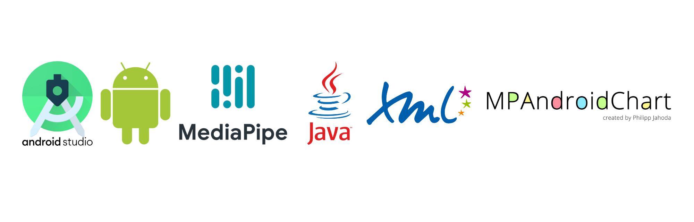
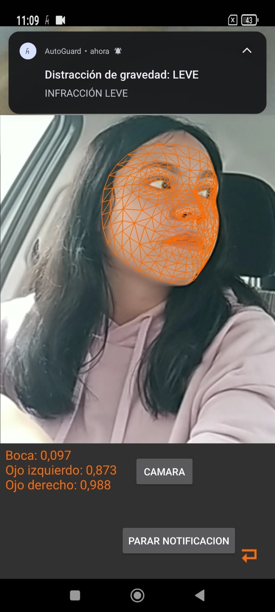
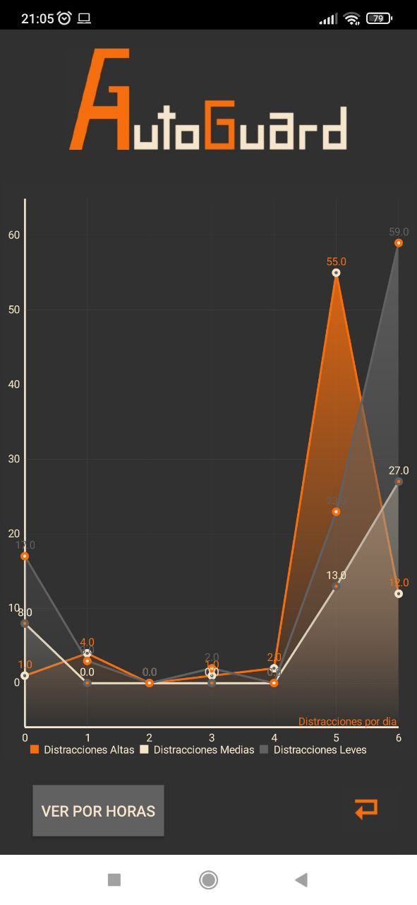
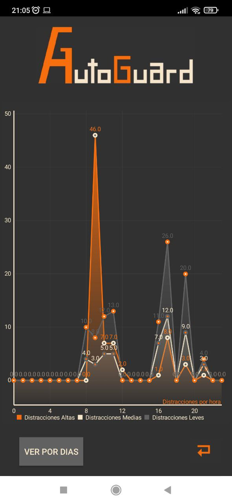
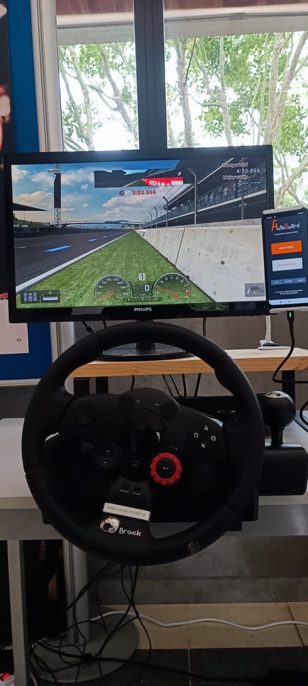
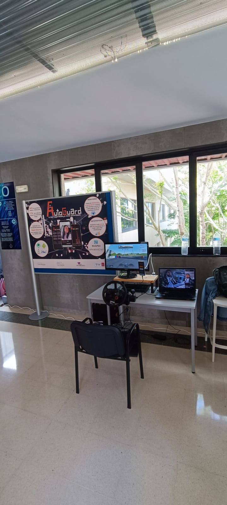

# AutoGuard 🛡️🚗

AutoGuard is an Android application designed to detect distractions and drowsiness while driving, promoting safer driving habits. 

    

---

## 🛠️ Technologies Used

- **[MediaPipe](https://mediapipe.dev/)**: Real-time facemesh implementation for facial detection.
- **[MPAndroidChart](https://github.com/PhilJay/MPAndroidChart)**: Charting library for visualizing distraction statistics.
- **Java**: Native Android development.

  

---

## 🚀 Key Features

- **Facial Distraction Detection**: Analyzes the driver’s attention in real time.
- **Smart Notifications**: Alerts based on the severity of distractions.
- **Detailed Graphs**: Visualizes statistics by hours and days.
- **User-Friendly Interface**: Intuitive design with accessible buttons.

---

## 📸 Screenshots

### Real-Time Monitoring

  

### Detailed Statistics

  
  

### Project presentation

  
  

---

## 📈 How It Works

1. **Real-Time Facemesh**: Uses MediaPipe's algorithm to map key facial features.
2. **Distraction Detection**: Calculates parameters such as eye opening and movements to evaluate attention levels.
3. **Data Visualization**: Collected statistics are displayed through detailed graphs.

---

## 🏆 Final Grade

This project was graded **9.3/10**, showcasing its effectiveness and innovation.

---
